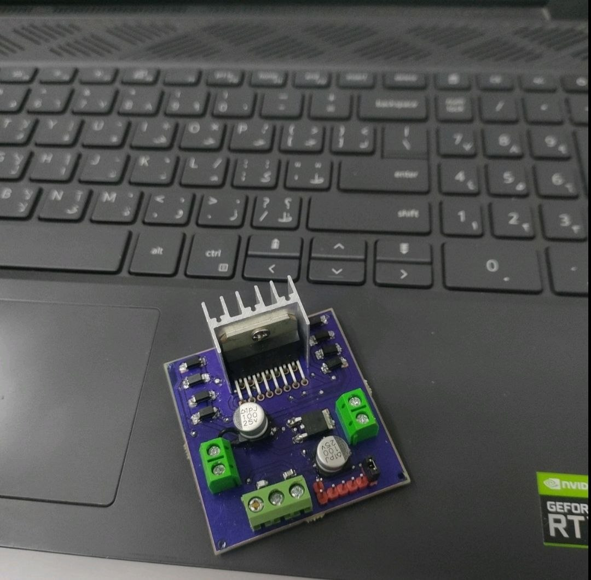

# Motor Driver Project ⚙️🔌

A simple and practical Motor Driver project designed to control a DC motor using an electronic driver circuit.

This project allows the motor to be powered and controlled through a driver stage instead of connecting the motor directly to the control circuit.  
The driver circuit helps provide the required current for the motor and makes the control process safer and more stable.

> Small circuit, powerful control, and a practical step into motor driving. 🔥

---

## Project Preview 📸

---

## Watch It in Action 🔥

Here is a short video showing the motor driver while operating 👇

- 🎥 [Motor Driver Demo Video](https://drive.google.com/file/d/1xdPbL0yKaXlAei1mflsUjOx5txSlaUxq/view?usp=drivesdk)

---

## Features

- Controls a DC motor
- Provides a safer way to drive the motor
- Supports motor ON/OFF control
- Helps handle motor current requirements
- Useful for basic robotics and electronics projects
- Practical circuit for learning motor control

---

## What It Does

- Takes a control signal
- Drives the DC motor through a driver circuit
- Protects the control side from direct motor load
- Allows the motor to operate more reliably
- Helps understand how motor driving circuits work

---

## How It Works

The control circuit sends a signal to the motor driver stage.

The driver circuit then allows current to flow through the motor, making it run.  
Instead of powering the motor directly from the controller, the motor driver handles the motor load and provides better control.

In simple words:

the controller gives the command, the driver handles the power, and the motor moves. ⚙️🔥

---

## Applications

- DC motor control
- Small robotics projects
- Electronics lab experiments
- Automation projects
- Motor testing circuits
- Educational control projects

---

## Project Goal

The goal of this project is to build a simple and practical motor driver circuit that can control a DC motor safely and help understand the basics of motor control and power driving circuits.
